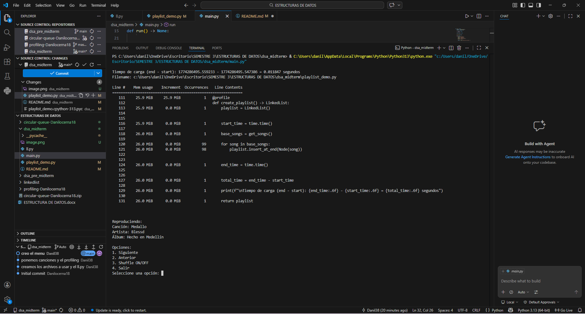
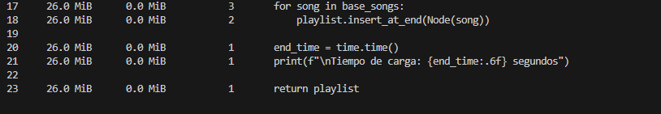

la lista que se implemento no circular fue con node y linkedlist y las canciones se escribieron manualmente en playlist_demo.py
el tiempo se visualizo con time y la memoria con memory_profiler segun lo que vi la complejidad es o(n) ocea lineal para recorrer y para la seleccion de una aleatoria es constant4e

para correrlo solo le das play a main.py porque por las ultimas lineas que puse te deja correrlo sin necesidad de nada 
 este es el profiling ahi sale hasta arriba el tiempo y abajo la memoria 

